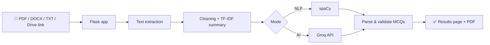

 

  

&nbsp;

&nbsp;

&nbsp;

 

## 🧭 About Me

I'm a final-year **B.Tech student in CSE (AI & ML)** at GLA University, Mathura, graduating in 2027.

I mostly build **backends** — the parts where details matter: who gets let in, what happens when a request is retried, and whether two database writes succeed or fail together. **AuthAPI** and **LedgerFlow** came out of wanting to understand those problems by building them.

I solve **DSA problems daily** in Java and Python (500+ across LeetCode, CodeChef, GFG) and I'm getting into **LLM applications** — I've built an MCQ generator on top of spaCy + Groq API and I'm learning LangChain / LangGraph by building small agentic systems.

> 💡 **How I learn:** pick up the concept → build something with it → read back through the implementation → improve it.

 

| 🎓 Education | 🧩 Problem Solving | 🎯 Focus |
| :---: | :---: | :---: |
| B.Tech CSE (AI & ML), GLA University graduating 2027 | 500+ problems on LeetCode, CodeChef & GFG | Backend APIs, databases, LLM applications |

---

## 🛠️ Tech Stack

**Languages**

**Backend**

**Databases & Caching**

**AI / NLP**

**Frontend & Tools**

---

## 🚀 Featured Projects

<table>
<tr>
<td width="50%" valign="top">

#### 🔐 AuthAPI

*Auth backend — sign-up to session management, plus the email flows around it.*

- JWT auth with refresh tokens & session management
- Email verification & password reset flows
- Emails sent via **BullMQ** background queue — requests never block on the mail server
- Request validation + auth middleware
- Redis for supporting functionality

    

👉 [View on GitHub](https://github.com/Ishu6129/AuthAPI)

</td>
<td width="50%" valign="top">

#### 💸 LedgerFlow

*REST API for moving money between users — built to understand what must stay true when one transfer touches several records.*

- User & account management, balances, transaction history
- Transfers inside **MongoDB sessions & transactions** — debit & credit succeed or fail together
- **UUID idempotency keys** — a retried request never applies the same transfer twice
- Full ledger records for every transaction
- JWT authentication

   

👉 [View on GitHub](https://github.com/Ishu6129/LedgerFlow)

</td>
</tr>
<tr>
<td colspan="2" valign="top">

#### 📝 AutoQGen

*Flask app that generates MCQs from study material — upload a PDF, DOCX, TXT or Google Drive link, pick local NLP (spaCy) or LLM (Groq API), and download the result as a PDF.*

     

</td>
</tr>
</table>

---

## 📊 GitHub Analytics

&nbsp;&nbsp;

  

  

---

## 🌱 Currently

- Building backend projects that go **past CRUD**: queues, transactions, retries
- Working through **DSA** problems in Java & Python
- Learning **LangChain & LangGraph** by building small agentic systems

---

## 🤝 Let's Connect

If you want to talk backend, DSA, or something you're building:

&nbsp;

  

